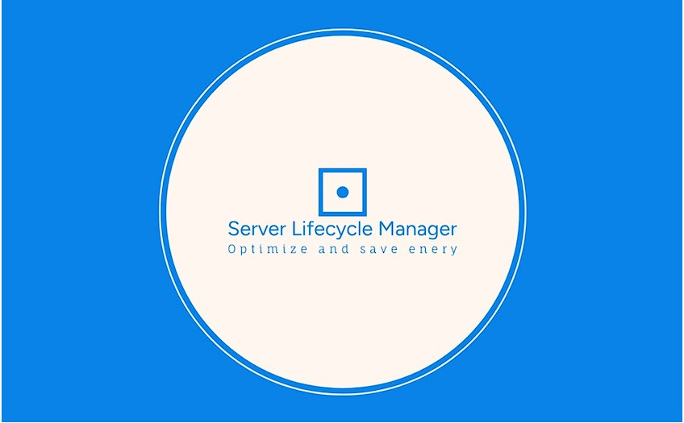

<!-- 1920x1080 is 16:9 -->
<!-- 1600x900 is 16:9 -->
<!-- TM's laptop is need to be confirmed -->

<!-- .slide: data-background="images/setu_background.png" -->
# LCManager Presentation

Tibor Molnar - <20074237@mail.wit.ie>

---

<!-- .slide: data-background="images/setu_background.png" -->

## Summary

* Background
* The Web Application
* Orchestration
* AI

---

<!-- .slide: data-background="images/setu_background_no_logo.png" -->

## Personal backround
* Computer Networks
* Systems Administrator
* Education Upskill
  * South East Technological University
    * Bachelors of Science in Information Technology
    * Higher Dimploma in Computer Science
    
---

<!-- .slide: data-background="images/setu_background_no_logo.png" -->

## Application's Background

* The idea originates from a need of a monitoring system that can track the lifecycle status of servers
* Support status and updates
* NodeJs and Hapi server side framework

---

<!-- .slide: data-background="images/setu_background_no_logo.png" -->

## Lifecycle stages

1. Purchasing has been initiated for the machine
2. New deploy, full support 0-3 years
3. Review support to run it on optimal performance 3-5 years
4. End of Original equipment manufacturer warranty 5-7 years
5. Device becomes legacy 7-10 years
6. End of life 10++ years

---

<!-- .slide: data-background="images/setu_background_no_logo.png" -->

## Login
* Protected access

  

----

## Provision - Server

  

----

## Listing / Monitoring - Servers

  

----

## Server - Detailed view

  

----

## Service Catalogue

  

Note:
Monitor hardware, virtual machines and also data gathering processes

----

## Overall Architecture

  

Note:
Monitor hardware, virtual machines and also data gathering processes

---

<!-- .slide: data-background="images/setu_background_no_logo.png" -->

## Archives
* Servers archived
  * Keep a record
  * Re-use 

  

----

## Restore

  

Note:
Monitor hardware, virtual machines and also data gathering processes

---

<!-- .slide: data-background="images/setu_background_no_logo.png" -->

## Orchestration

  

* Application is version controlled by github

---

## Thank you and any Questions?

  

---

# Backup Slides

----

### Development

  

Note:

----

## END